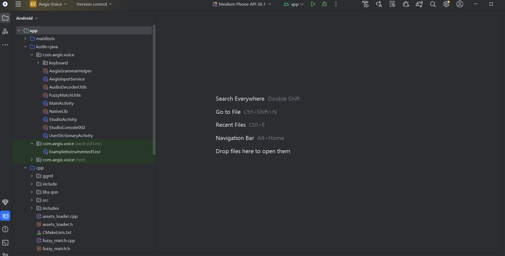
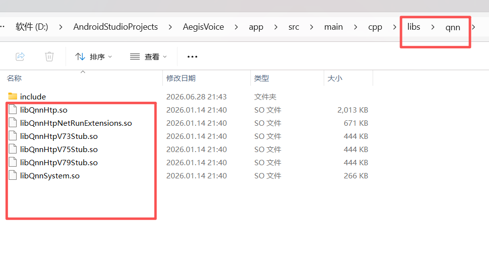
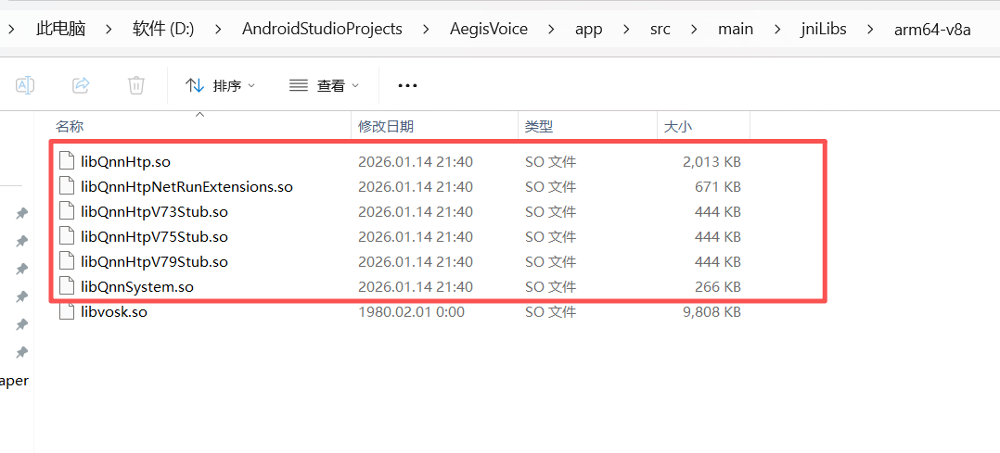

# Aegis Voice - Titan V13 Core

The world's most hardcore, entirely on-device offline AI voice transcription engine, engineered for absolute privacy and ultra-long professional meetings. Built upon the architectural foundation of Patent CN 122201305 A.

---

## 💎 The $299 Value Proposition 

The commercial release of this architecture is currently live on Google Play as **[Aegis Offline AI Keyboard](https://play.google.com/store/apps/details?id=com.aegis.voice&pli=1)**, priced at **$299 USD**. 

**Why $299?** 
Mainstream transcription apps trap you in endless monthly subscriptions and secretly upload your highly sensitive boardroom audio to their cloud servers. Aegis changes the paradigm:
* **One-time purchase, lifetime access.**
* **Real-time Dictation:** Continuously transcribe for up to **200 minutes** without dropping a syllable.
* **Offline Studio (Batch Processing):** Import heavy MP3/MP4 files and transcribe up to **500 minutes** in one go. 
* **Zero-Network Policy:** 100% of the compute happens on your physical silicon. As long as your phone has battery, Aegis is on duty 24/7.

> **Open Source Mission:** 
> We are open-sourcing the Titan V13 Core under the MIT License. If you are a developer, you are free to clone, compile, and use this architecture at no cost. If setting up the build environment is too much of a hassle, we welcome you to support our work by downloading the official, ready-to-use app from Google Play.

---

## 🎯 Capabilities & Language Boundaries

* **English ONLY:** To maintain the highest possible accuracy and build the ultimate contextual magnetic field for the underlying LLM, this engine is strictly dedicated to the English language. (No Chinese or multi-language support is included in this build).
* **Conservative Marketing, Aggressive Delivery:** We officially advertise an accuracy rate of 82%. However, thanks to our proprietary C++ `FuzzyMatch` engine and local VIP Hotword injection, the real-world accuracy consistently hits **92%**.

---

## 🎛️ Hardware Requirements & The "Compute Dashboard"

Aegis handles hardware disparity elegantly through its built-in **Compute Dashboard**. 

* **Flagship Devices (Snapdragon 8 Gen 3, Gen 4, Gen 5):** 
  True real-time performance. If you record a 1-hour meeting and hit stop, the final text is fully processed and rendered on your screen within 1 to 2 seconds. The NPU easily outpaces human speech.
* **Legacy/Mid-range Devices (Snapdragon 8 Gen 2 and below):** 
  **It will NOT crash.** However, the NPU/CPU compute cannot keep up with real-time speech. The Dashboard will indicate a backlog (e.g., "100 slices pending"). If you record for 1 hour, it may take an additional hour for the background queue to clear after you stop the mic. 
* **The Verdict:** The engine is immortal. It will eventually finish the job without OOM (Out of Memory) crashes, but your hardware dictates your speed.

---

## 📂 Engineering Architecture

Aegis enforces strict physical isolation between the Java/Kotlin UI layer, the C++ compute/cryptography layer, and the encrypted assets.

---

## ⚙️ Qualcomm QNN NPU Setup (Unlocking Maximum Power)

This project natively supports Qualcomm's Hexagon DSP/NPU hardware acceleration. However, due to Qualcomm's proprietary licensing, **we cannot distribute the official `.so` binaries in this repository.**

To unleash the NPU:
1. Download the official Qualcomm Neural Network (QNN) SDK from the Qualcomm Developer Network.
2. Extract and place the required binaries (e.g., `libQnnHtp.so`, `libQnnSystem.so`) exactly as shown in the blueprints below:

*Note: Our `CMakeLists.txt` is equipped with an auto-detection shield. If you do not provide these QNN binaries, the engine will safely and automatically downgrade to CPU/GPU execution without throwing build errors.*

---

## ⚖️ License

This project is open-sourced under the **MIT License**. 

You are free to use, modify, and distribute this software in personal or commercial projects, provided that the original copyright notice and permission notice are included in all copies or substantial portions of the software. 

*Thank you for supporting the pursuit of true on-device AI and absolute privacy.*
